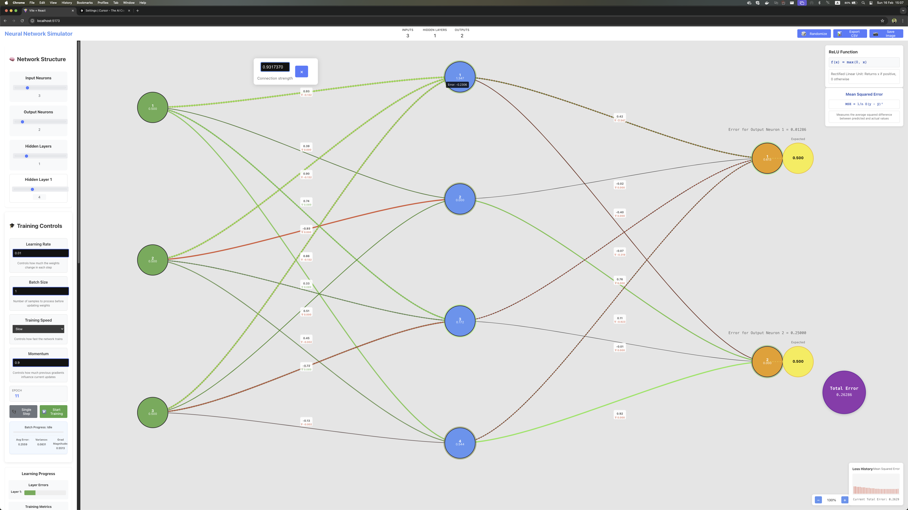

# Neural Network Simulator

An interactive, real-time visualization tool for understanding neural networks, backpropagation, and deep learning concepts.



## Features

### Network Structure
- Dynamic network architecture configuration
  - Adjustable input layer (1-10 neurons)
  - Configurable hidden layers (0-5 layers)
  - Customizable neurons per hidden layer (1-10 neurons)
  - Flexible output layer (1-10 neurons)
- Real-time visualization of network topology
- Interactive neuron and weight manipulation

### Learning Components

#### Activation Functions
- ReLU (Rectified Linear Unit)
- Sigmoid
- Tanh (Hyperbolic Tangent)
- Linear
- Visual function graphs with mathematical formulas
- Real-time activation value display

#### Loss Functions
- Mean Squared Error (MSE)
- Mean Absolute Error (MAE)
- Binary Cross Entropy
- Mathematical formulas and descriptions
- Loss history visualization

#### Training Mechanics
- Backpropagation implementation
- Gradient descent optimization
- Momentum-based learning
- Configurable learning rate
- Batch processing capabilities
- Single-step training option

### Visualization Features

#### Network Display
- Color-coded neurons by layer
- Weight visualization
  - Line thickness based on weight magnitude
  - Color-coding (green for positive, red for negative)
  - Interactive weight adjustment
- Animated gradient flow
- Error visualization rings
- Pan and zoom controls

#### Training Progress
- Layer-wise error visualization
  - Color-coded error rings
  - Error magnitude indicators
  - Interactive error tooltips
- Real-time metrics
  - Learning rate monitoring
  - Stability score
  - Convergence status
  - Batch statistics
- Loss history graph
- Training progress indicators

#### Interactive Elements
- Draggable popups for value editing
- Hover tooltips with detailed information
- Click-to-edit functionality
- Real-time value updates

### Training Controls
- Start/Stop training
- Single step execution
- Batch size adjustment
- Training speed control
- Momentum configuration
- Weight randomization
- Learning rate adjustment

### Advanced Features
- Batch processing with progress tracking
- Gradient visualization and monitoring
- Error propagation display
- Convergence detection
- Performance metrics
- Network state export

## Usage

### Basic Operations
1. Configure Network Structure
   - Set input/output neurons
   - Add hidden layers
   - Adjust neurons per layer

2. Training Setup
   - Choose activation function
   - Select loss function
   - Set learning rate
   - Configure batch size
   - Adjust momentum

3. Training Process
   - Initialize weights
   - Set input values
   - Define expected outputs
   - Start training or use single-step
   - Monitor progress and metrics

### Advanced Usage
- Use single-step training for detailed observation
- Monitor gradient flow and error propagation
- Adjust weights manually for experimentation
- Export network configuration and weights
- Analyze training stability and convergence

## Technical Details

### Implementation
- Built with React
- SVG-based visualization
- Real-time calculations and updates
- Modular component architecture
- Responsive design

### Performance
- Optimized rendering
- Efficient gradient calculations
- Smooth animations
- Responsive user interface

## Getting Started

```bash
# Clone the repository
git clone [repository-url]

# Install dependencies
npm install

# Start the development server
npm run dev
```

## Contributing
Contributions are welcome! Please read our contributing guidelines for details.

## License
This project is licensed under the MIT License - see the LICENSE file for details.